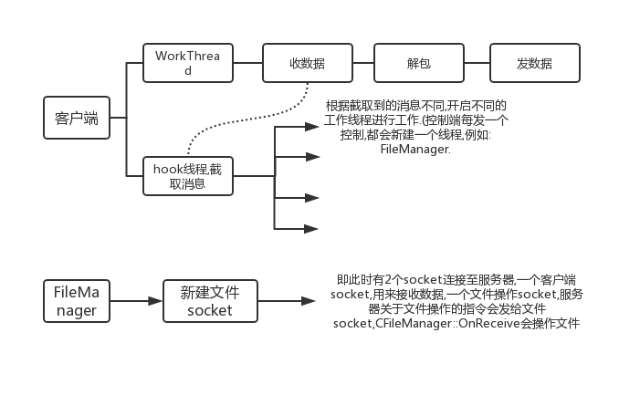
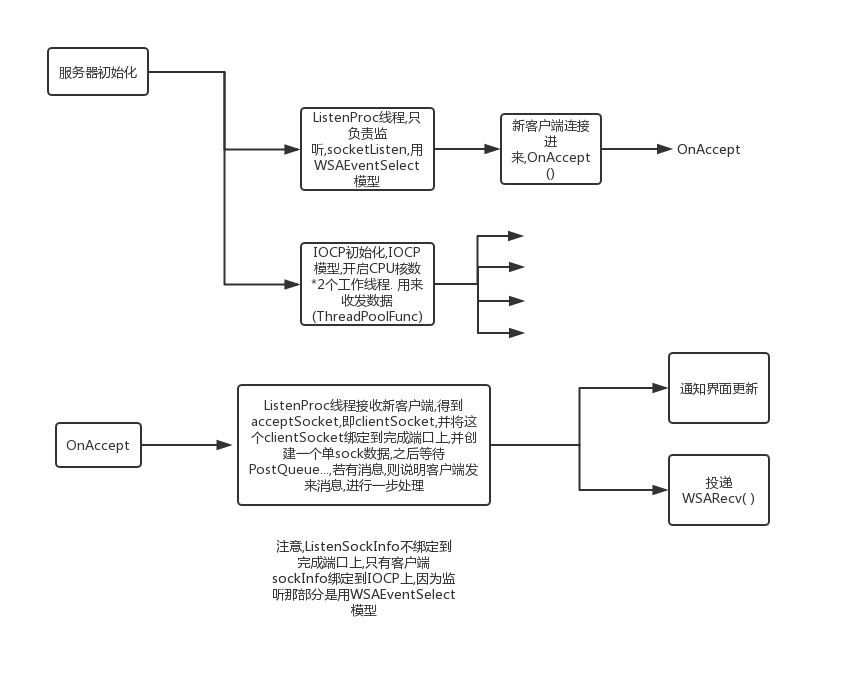

## 对gh0st客户端线程的补充分析



- 关于WindowsHook的[介绍](https://blog.csdn.net/ljheee/article/details/52040233)

## 对gh0st服务器初始化流程


对于服务器发数据注意的事项: ```Send()```都是将应答数据解包写入```writebuffer```(CBuffer类,动态数组),写入后就等待发送. 而在```OnClientWriting()```中,将```wsaoutbuffer```指向```writebuffer```并发送,这样就解决发送动态大小的数据的问题.    
若```writebuffer```中没有发完(此处应该是用```writebuffer.Delete(dwIosize)```判断),则继续投递```WSASend```发.    
这里注意,```DoRecv()```后,投递完```Send请求```后,立即又```PostRecv```,我之前一直写的都是收到数据后,发送完回应数据再投递```Recv请求```.这样效率不高.   

但对于无法一次性收完数据时,gh0st没有交代,gh0st服务器认为收来的数据压缩后都可以放在一个8K的inbuffer中.默认一次就可以接收完.